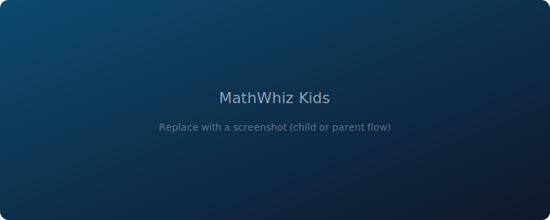

# MathWhiz Kids

MathWhiz Kids is an **AI-assisted math learning** experience for **elementary school children (K–5)**. It generates **story-based problems** matched to grade level, tracks practice, and gives parents a **dashboard** to monitor progress and set healthy usage limits.

**Author:** [Swathi Gunnala](https://github.com/SwathiGunnala) · Product manager · AI-assisted building



> **Add a screenshot:** replace the image above with a real export from the parent or child experience (see `docs/assets/`).

## Live demo

**[Open the published app on Replit](https://replit.com/@YOUR_USERNAME/mathwhiz-kids)** — replace with your **public Replit URL** (Replit → your Repl → **Publish**).

## Problem

Kids need practice that feels **engaging**, not generic drill sheets. Parents need **visibility** into progress and **controls** (time limits, multiple children) without a confusing setup. This project tests that combination: **curriculum-style topics**, **difficulty tiers**, **AI-generated story problems and lessons**, and a **parent-first navigation** model on web.

## What you ship (high level)

- **Story-based math** powered by AI (operations, geometry, grade-appropriate difficulty)  
- **K–5 topic map** with structured progression and difficulty multipliers  
- **Proficiency path** (e.g. Beginner → Master) tied to practice outcomes  
- **Parent dashboard:** sessions, usage, multiple children, daily time limits  
- **Accessibility / UX:** optional **voice / text-to-speech**; responsive layout (sidebar / mobile patterns)  
- **Dual platform:** **web** (React + Vite + Tailwind) is the primary experience; **Expo / React Native** code lives in the repo for a mobile path forward  

## How AI is used

- Generates story problems and supporting lesson copy aligned to grade and topic  
- Optional audio (TTS) via the same integration stack  
- Server-side calls to OpenAI; **no API keys in the repo**—use environment variables in Replit or your host  

## Tech stack

- **Web:** React 19, Vite 7, Tailwind CSS v4, Wouter, TanStack Query, Zustand  
- **Mobile (in repo):** Expo SDK 54, React Navigation  
- **Backend:** Express 5, TypeScript, REST under `/api`  
- **Database:** PostgreSQL (Neon) with **Drizzle ORM**; bcrypt for passwords  
- **AI:** OpenAI via Replit AI Integrations or equivalent env configuration  

## Prerequisites

- Node.js 20+ recommended  
- `DATABASE_URL` for PostgreSQL  
- OpenAI-related env vars as required by `server/ai.ts` and your deployment  

## Run locally

```bash
git clone https://github.com/SwathiGunnala/mathwhiz-kids.git
cd mathwhiz-kids
npm install
```

Configure environment variables (see **[replit.md](./replit.md)** for the authoritative list).

```bash
npm run dev
```

Production build uses `npm run build` and `npm start` per `package.json`—confirm paths for your deployment (Replit vs. static host).

## Documentation

- **[replit.md](./replit.md)** — Architecture, dual frontend layout, database schema, auth flows, and integrations.

## License

This project is licensed under the MIT License — see [LICENSE](./LICENSE).
